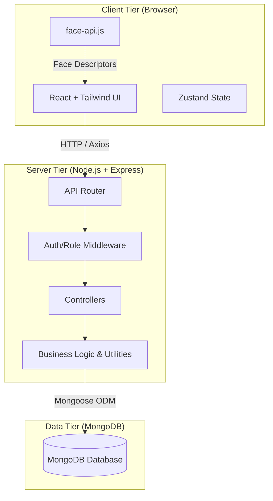
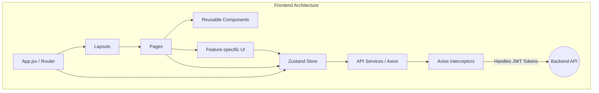
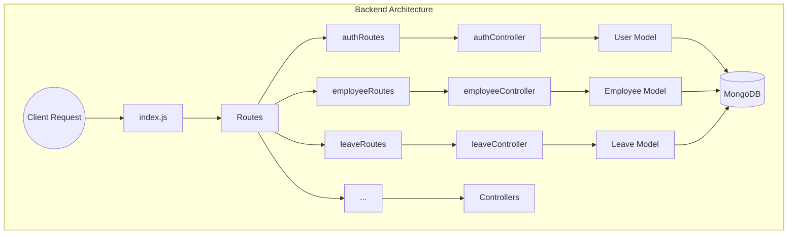
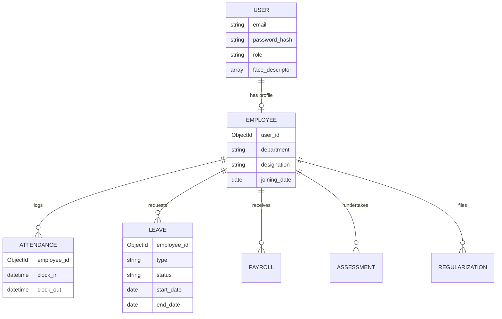
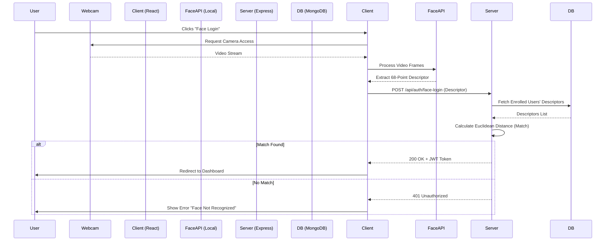

# HRMS Architectural Overview

This document outlines the high-level architecture of the Human Resource Management System (HRMS) based on the repository structure and technology stack.

## 1. High-Level System Architecture

The application follows a standard MERN-stack architecture (MongoDB, Express, React, Node.js), structured as a monolithic frontend interacting with a monolithic RESTful backend API. 

> [!NOTE]
> The face recognition process happens largely on the **Client Tier**. `face-api.js` processes the webcam feed locally to extract facial descriptors. Only these mathematical descriptors (not raw images) are sent to the backend for verification.

---

## 2. Frontend Architecture (React + Vite)

The frontend uses Vite as the bundler and React for the view layer. Global state is managed by Zustand.

### Key Frontend Directories
- **`src/components/`**: Reusable generic UI components (Buttons, Inputs, Modals).
- **`src/features/`**: Domain-specific logic and UI (e.g., authentication flow, face recognition handling).
- **`src/store/`**: Global state management using Zustand (likely holding auth state, user profile, etc.).
- **`src/services/`**: API definitions via Axios, including interceptors to attach JWT tokens to every request automatically.

---

## 3. Backend Architecture (Express.js)

The backend exposes a REST API consumed by the React client. It uses Mongoose to map application objects to MongoDB documents.

### Key Backend Directories
- **`routes/`**: Maps URL paths (e.g., `/api/auth`, `/api/leave`) to the appropriate controller methods.
- **`middlewares/`**: Contains intermediate logic, such as checking for valid JWTs (`protect`) or enforcing role-based access.
- **`controllers/`**: Contains the core business logic (handling requests, calling models, generating responses).
- **`models/`**: Defines the data schema using Mongoose (e.g., `User.js`, `Employee.js`, `Leave.js`, `Attendance.js`).

---

## 4. Module & Data Relationship Diagram

The HRMS system handles multiple distinct domains, such as Users, Employees, Attendance, and Leaves.

> [!TIP]
> The database strictly separates `User` (Authentication and Identity) from `Employee` (HR domain data), connected by a one-to-one relationship.

---

## 5. Face Recognition Login Flow

The most complex specialized flow in the system is the facial recognition login, which spans the client and server.

